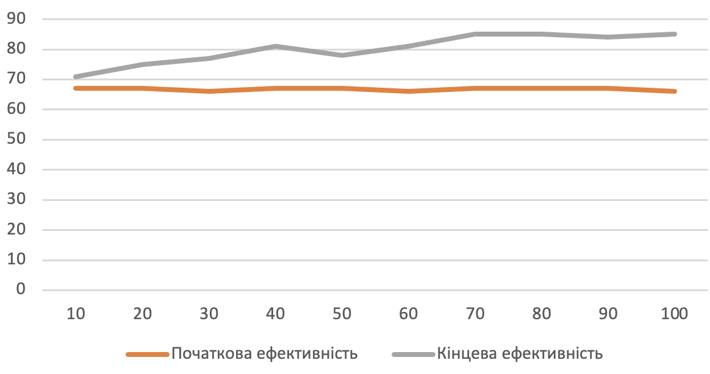
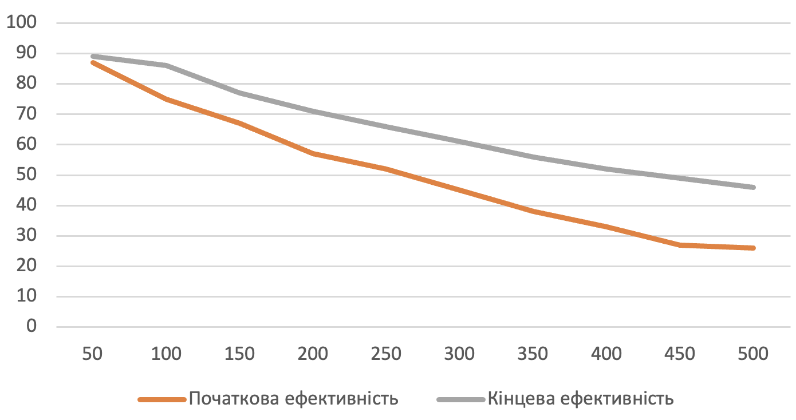
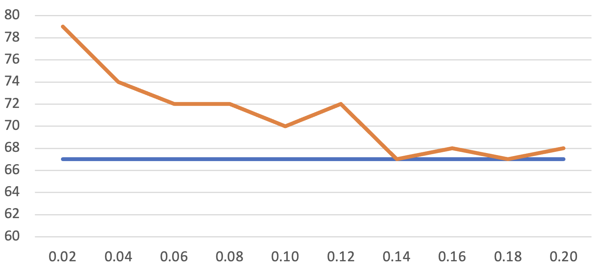

## Комп'ютерні системи імітаційного моделювання
## СПм-22-4, **Зубенко Володимир Петрович**
### Лабораторна робота №**1**. Опис імітаційних моделей та проведення обчислювальних експериментів

### Варіант 9, модель у середовищі NetLogo:
[Sheperds](http://www.netlogoweb.org/launch#http://www.netlogoweb.org/assets/modelslib/Sample%20Models/Biology/Shepherds.nlogo)

### Вербальний опис моделі:
Ця модель імітує поведінку пастухів і овець у середовищі, де пастухи намагаються зганяти овець у групи. У моделі використовується рух випадкових блукаючих овець і пастухів, які намагаються скеровувати їх у стадо. Успішність об'єднання овець у єдине стадо залежить від кількості пастухів та їхньої швидкості в порівнянні з вівцями. Модель дозволяє визначити вплив різних факторів, таких як кількість пастухів і їхній рух на результати групування, а також досліджувати ймовірність об'єднання великих стад.

### Керуючі параметри:
- **num-shepherds** - цей параметр вказує, скільки пастухів буде присутніми в середовищі під час запуску симуляції. Змінюючи значення "num-shepherds" за допомогою відповідного слайдера, ви можете впливати на кількість пастухів, які будуть спробувати зганяти вівці у групи під час виконання симуляції.
- **num-sheep** -цей параметр вказує, скільки вівців буде присутними в середовищі під час запуску симуляції. Змінюючи значення "num-sheep" за допомогою відповідного слайдера, ви можете контролювати кількість вівців, які блукають у цьому середовищі під час виконання симуляції. 
- **sheep-speed** - wей параметр вказує на швидкість руху вівців відносно пастухів. Змінюючи значення "sheep-speed" за допомогою відповідного слайдера, ви можете контролювати те, наскільки швидко вівці рухаються порівняно з пастухами під час виконання симуляції.
- 
### Внутрішні параметри:
- **sheepless-neighborhoods** - відображає кількість патчів у середовищі, в яких немає вівців у сусідніх патчах. Вона використовується для вимірювання того, наскільки добре пастухи пасуть вівців.
- **herding-efficiency** - ця змінна використовується для вимірювання того, наскільки ефективно пастухами пасуть овець. Вимірюється відсотками.
- **sheep-nearby** - вказує скільки вівців знаходиться в сусідніх патчах для кожного патча в середовищі.
- **carried-sheep** - вівця, яку несе пастух (або ніхто, якщо не несе)
- **found-herd?** - Ця змінна вказує, чи знайшов пастух групу (стадо) для скидання вівці. Вона встановлюється в true, якщо пастух знайшов групу.
- 
### Показники роботи системи:
- **Current efficiency**: Ефективність утримання стада в даний момент. Ефективність утримання стада вимірюється тут шляхом підрахунку кількості ділянок, у яких немає овець. ефективність = райони без овець / (кількість ділянок - кількість овець) [виражено у відсотках]
- **Herding efficiency**: графік ефективності пастухів.

### Примітки:
- Коли починають формуватися невеликі стада овець, стада ніяк не «захищені», пастухи можуть забирати овець зі стад. Якби стада були «захищені», ви б отримали багато маленьких стад, а не кілька великих
- Якщо пастухів достатньо і/або пастухи рухаються набагато швидше, ніж вівці, кількість стад з часом зменшується.
- Цей проект є хорошим прикладом імовірнісної та децентралізованої стратегії. Немає ні головного пастуха, ні спеціального місця для стад. Рух пастухів і овець і, отже, їхня поведінка є імовірнісними. Кожен пастух дотримується ряду простих правил, але група в цілому виконує досить складні завдання.

### Недоліки моделі:
- Кілька овець можуть займати одне фізичне місце. І, оскільки всі пастухи шукають вівцю, щоб підібрати її, перш ніж хтось із них фактично забере вівцю, пастух може підійти до місця з кількома вівцями та, оглянувши одну навмання, виявити, що інший пастух уже схопив цю вівцю.
- Справжні пастухи часто використовують вівчарок, щоб допомогти їм у випасі. В цій можелі їх немає.
- Насправді, в цій моделі пастухи ніяк не "підбирають" овець. Вони їх "вбивають", а потім в потрібно місці в стаді "створюють" нових овець. Це доволі дивно і не реалістично.
- Алгоритм, за яким рухаються пастухи, є досить простим та випадковим, і не враховує реалістичні аспекти роботи пастуха.
- Всі пастухи (навіть якщо їх 100) намагаються зібрати овець в одне стадо. Це доволі не реалістично, адже в реальному житті на стадо потрібно не так і багато пастухів і на одному полі можуть бути різні групи пастухів.

## Обчислювальні експерименти
### 1. Вплив кількості пастухів на ефективність випасання
Досліджується залежність кількості пастухів на ефективність випасання овець через 500 тактів.
Експерименти проводяться при 10-100 пастухів, з кроком 10, усього 10 симуляцій.  
Інші керуючі параметри мають значення за замовчуванням:
- **num-sheep**: 150
- **sheep-speed**: 0.02

<table>
<thead>
<tr><th>Кількість пастухів</th><th>Початкова ефективність</th><th>Кінцева ефективність</th></tr>
</thead>
<tbody>
<tr><td>10</td><td>67</td><td>71</td></tr>
<tr><td>20</td><td>67</td><td>75</td></tr>
<tr><td>30</td><td>66</td><td>77</td></tr>
<tr><td>40</td><td>67</td><td>81</td></tr>
<tr><td>50</td><td>67</td><td>78</td></tr>
<tr><td>60</td><td>66</td><td>81</td></tr>
<tr><td>70</td><td>67</td><td>85</td></tr>
<tr><td>80</td><td>67</td><td>85</td></tr>
<tr><td>90</td><td>67</td><td>84</td></tr>
<tr><td>100</td><td>66</td><td>85</td></tr>
</tbody>
</table>

Висновки експеременту:
- Зі збільшенням кількості пастухів відзначається загальне покращення ефективності випасання вівців. У даному експерименті спостерігається підвищення ефективності з 67% на початку до 71-85% у кінці.
- При невеликій кількості пастухів (наприклад, 10), ефективність зростає, але підвищення не настільки помітне, як при більшій кількості пастухів.
- Існує певна межа, після якої збільшення кількості пастухів призводить до менш помітного підвищення ефективності або взагалі не впливає. Наприклад, від 70 до 100 пастухів різниця в ефективності не так помітна.

### 2.  Вплив кількості овець на ефективність випасання
Досліджується залежність кількості овець на ефективність випасання пастухами через 500 тактів.
Експерименти проводяться при 50-500 пастухів, з кроком 50, усього 10 симуляцій.  
Інші керуючі параметри мають значення за замовчуванням:
- **num-shepherds**: 30
- **sheep-speed**: 0.02

<table>
<thead>
<tr><th>Кількість овець</th><th>Початкова ефективність</th><th>Кінцева ефективність</th></tr>
</thead>
<tbody>
<tr><td>50</td><td>87</td><td>89</td></tr>
<tr><td>100</td><td>75</td><td>86</td></tr>
<tr><td>150</td><td>67</td><td>77</td></tr>
<tr><td>200</td><td>57</td><td>71</td></tr>
<tr><td>250</td><td>52</td><td>66</td></tr>
<tr><td>300</td><td>45</td><td>61</td></tr>
<tr><td>350</td><td>38</td><td>56</td></tr>
<tr><td>400</td><td>33</td><td>52</td></tr>
<tr><td>450</td><td>27</td><td>49</td></tr>
<tr><td>500</td><td>26</td><td>46</td></tr>
</tbody>
</table>

Висновки експеременту:
- Більша кількість овець призводить до більшої розкиданості і розпорошеності стада, що робить випасання менш ефективним.
- Пастухам потрібно більше зусиль та часу, щоб згуртувати та керувати більшим стадом, що впливає на ефективність.
- Чим більше стає овець, тим швидше росте ефективність випасання. Але, загалом, це не суттєво.

### 3. Вплив швидкості овець на ефективність випасання
Досліджується залежність швидкості овець на ефективність випасання пастухами через 500 тактів.
Експерименти проводяться при 0.02 - 0.2 швидкості овець відносно пастухів, з кроком 0.02, усього 10 симуляцій.  
Інші керуючі параметри мають значення за замовчуванням:
- **num-shepherds**: 30
- **num-sheep**: 150

<table>
<thead>
<tr><th>Швидкість овець</th><th>Початкова ефективність</th><th>Кінцева ефективність</th></tr>
</thead>
<tbody>
<tr><td>0.02</td><td>67</td><td>79</td></tr>
<tr><td>0.04</td><td>67</td><td>74</td></tr>
<tr><td>0.06</td><td>67</td><td>72</td></tr>
<tr><td>0.08</td><td>67</td><td>72</td></tr>
<tr><td>0.10</td><td>67</td><td>70</td></tr>
<tr><td>0.12</td><td>67</td><td>72</td></tr>
<tr><td>0.14</td><td>67</td><td>67</td></tr>
<tr><td>0.16</td><td>67</td><td>68</td></tr>
<tr><td>0.18</td><td>67</td><td>67</td></tr>
<tr><td>0.20</td><td>67</td><td>68</td></tr>
</tbody>
</table>

Висновки експеременту:
- Збільшена швидкість овець призводить до більшої розкиданості та розпорошеності стада, що робить випасання менш ефективним.
- Пастухам потрібно більше зусиль та часу, щоб згуртувати та керувати швидкими овцями, що доволі очевидно.
- При високій швидкості овець, пастухи мають більше труднощів у групуванні вівців і веденні їх до одного стада, що призводить до зменшення ефективності. При значеннях швидкості більше 0.12 стадо стає абсолютно некерованим. Хоча навіть при швидкості 0.12 візуально не виглядає, що пастухи мають хоч якийсь контроль.

