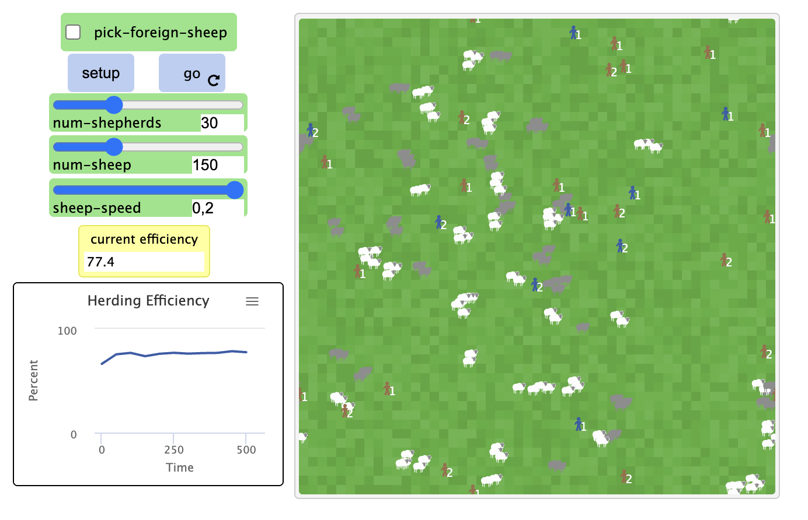
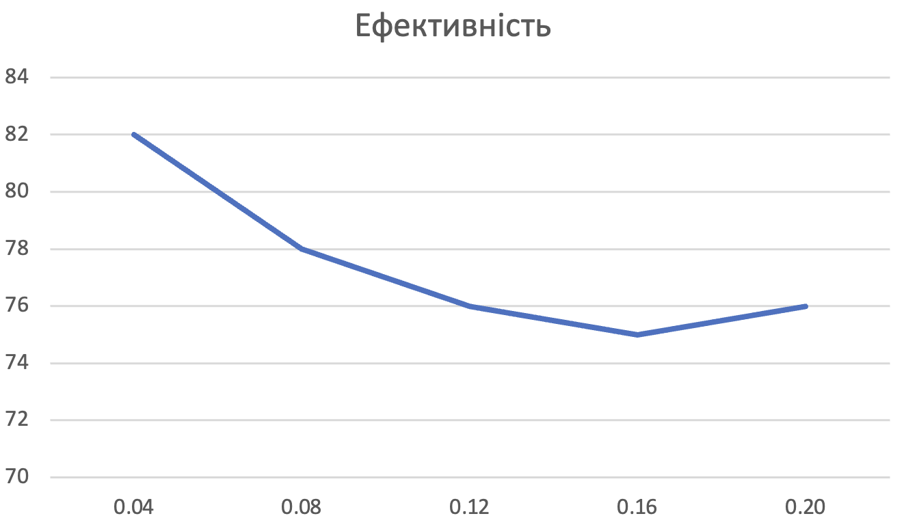

## Комп'ютерні системи імітаційного моделювання
## СПм-22-4, **Зубенко Володимир Петрович**
### Лабораторна робота №**2**. Редагування імітаційних моделей у середовищі NetLogo

### Варіант 9, модель у середовищі NetLogo:
[Sheperds](http://www.netlogoweb.org/launch#http://www.netlogoweb.org/assets/modelslib/Sample%20Models/Biology/Shepherds.nlogo)

 

### Внесені зміни у вихідну логіку моделі, за варіантом:

**Поділити вівець на два різних стада, відповідно і пастухів на дві різні організації. Пастухи повинні збирати тільки "своїх" вівець.** 

Створено новий параметр для визначення групи овець та пастухів під назвою **team**, що вказує на їхню приналежність до першої або другої організації:
<pre>
shepherds-own
[
  team 
  carried-sheep         ;; the sheep I'm carrying (or nobody if I'm not carrying in)
  found-herd?           ;; becomes true when I find a herd to drop it in
]

</pre>

Змінено search-for-sheep та find-new-herd. Тепер пастух обирає тільки ту вівцю, яка відповідає його організації. І жене вівцю у стадо тієї ж організації.
<pre>
to search-for-sheep ;; shepherds procedure
set carried-sheep one-of sheep-here with [not hidden? and team = [team] of myself]

if (carried-sheep != nobody and team = [team] of carried-sheep)
  [
    ask carried-sheep
      [ hide-turtle ]  ;; make the sheep invisible to other shepherds
         ;; turn shepherd blue while carrying sheep
    fd 1
  ]
end

to find-new-herd ;; shepherds procedure
if any? sheep-here with [not hidden? and team = [team] of myself]
  [ set found-herd? true ]
end
</pre>

Змінено процедуру setup. Тепер при запуску випадково визначається до якої організації відноситься вівця та пастух. Також змінено кольори овець, а пастухам додано написи до якої організації вони відносяться.
<pre>
 create-sheep num-sheep
[ 
    set team one-of [1 2]
    ifelse team = 1 [ set color white] [ set color grey]
    set size 1.5  ;; easier to see
    setxy random-xcor random-ycor
]
create-shepherds num-shepherds
[ 
    set color brown
    set team one-of [1 2]
    set size 1.5  ;; easier to see
    set carried-sheep nobody
    set found-herd? false
    setxy random-xcor random-ycor
    ifelse team = 1 [set label "1"][set label "2"]
]
</pre>

                  
**Додати відключаєму можливість збирати "чужих" вівець, які після потрапляння до нового стада змінюють свою приналежність.**
Додано switch **pick-foreign-sheep**:

Змінено процедуру search-for-sheep:
<pre>
to search-for-sheep ;; shepherds procedure
  
set carried-sheep one-of sheep-here with [(not hidden? and ( pick-foreign-sheep or team = [team] of myself))]
let my-team team
if (carried-sheep != nobody)
  [
    ask carried-sheep
      [ hide-turtle 
        set team my-team
        ifelse team = 1 [ set color white] [ set color grey]
    ]  ;; make the sheep invisible to other shepherds
    fd 1
    set color blue ;; turn shepherd blue while carrying sheep
  ]
end
end
</pre>

### Внесені зміни у вихідну логіку моделі, на власний розсуд:
**Змінено алгоритм переміщення овець**

Вівці будуть слідувати одна за одною, якщо будуть бачити одне одну. Вони бачать на 3 пачта. Також, тепер не може бути багато овець на одному патчі. Вівці намагатимуться не заходити на один патч. Також вівці будуть відрізняти одна одну по кольору і йтимуть за вівцею з тим же кольором. Для цього створено процедуру follow-other-sheep.
<pre>
to follow-other-sheep
  let my-color color
  let closest-sheep min-one-of other sheep with [color = my-color][distance myself]
  ifelse distance closest-sheep < 3  and distance closest-sheep > 1
    [face closest-sheep]
    [wiggle]
  
end
</pre>

Зміни в процедурі go :
<pre>
  
to go
  ask shepherds
  [ ifelse carried-sheep = nobody
      [ search-for-sheep ]     ;; find a sheep and pick it up
    [ ifelse found-herd?
        [ find-empty-spot ]  ;; find an empty spot to drop the sheep
      [ find-new-herd ] ]  ;; find a herd to drop the sheep in
    wiggle
    fd 1
    if carried-sheep != nobody
    ;; bring my sheep to where I just moved to
    [ ask carried-sheep [ move-to myself ] ]
    ifelse team = 1 [set label "1"][set label "2"]
  ]
  ask sheep with [not hidden?]
  [ follow-other-sheep
    fd sheep-speed ]
  tick
end
</pre>

Фінальний код моделі та її інтерфейс доступні за [посиланням](model.nlogo). 
 
  
## Обчислювальні експерименти
### 1. Вплив швидкості овець на ефективність випасання
Досліджується залежність ефективності випасання від  швидкості овець через 1 000 тактів.
Експерименти проводяться при 0.04 - 0.20 швидкості овець відносно пастухів, з кроком 0.04, усього 5 симуляцій.  
Інші керуючі параметри мають значення за замовчуванням:
- **num-shepherds**: 30
- **num-sheep**: 150
- **pick-foreign-sheep**:off

<table>
<thead>
<tr><th>Швидкість овець</th><th>Ефективність</th></tr>
</thead>
<tbody>
<tr><td>0.04</td><td>82</td></tr>
<tr><td>0.08</td><td>78</td></tr>
<tr><td>0.12</td><td>76</td></tr>
<tr><td>0.16</td><td>75</td></tr>
<tr><td>0.20</td><td>76</td></tr>
</tbody>
</table>

Графік наочно показує, що пастухам потрібно більше зусиль та часу, щоб згуртувати та керувати швидкими вівцями, що доволі очевидно. Проте цього разу вівці "розумніші" і ходять одна за одною. Тому навіть при високих швидкостях овець ефективність випасання сильно не падає.
